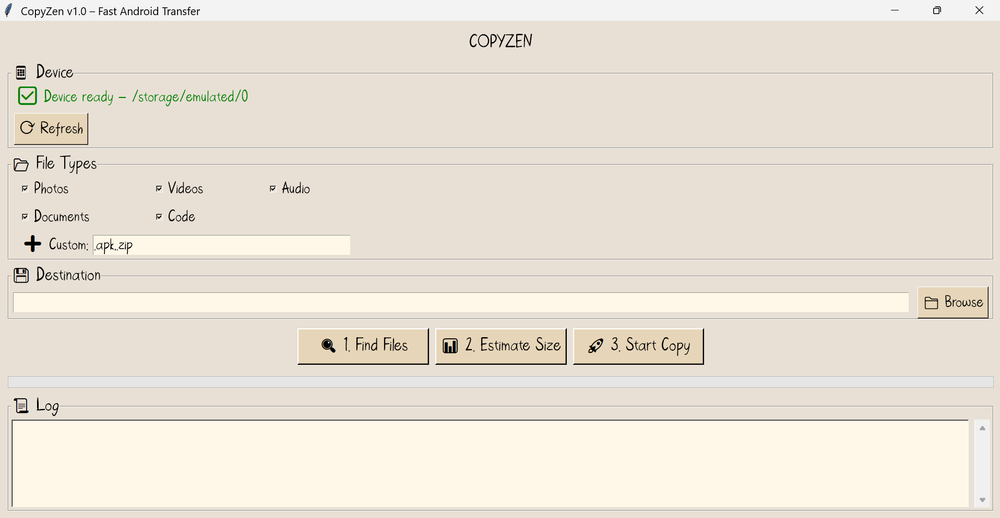

# CopyZen – Fast Android File Transfer

**CopyZen** is a desktop application that transfers photos, videos, music, documents, and any other files from an Android device to a Windows PC at **maximum speed** using parallel `adb pull`. No root required.

   <!-- optional: add a screenshot later -->

## ✨ Features
- **Blazing fast** – up to 3× faster than Windows MTP (tested: 84 GB in 1.5 hours).
- **Selective scraping** – choose file types (photos, videos, audio, documents, code, or custom extensions).
- **Size estimation** – shows total size before copying, checks free disk space.
- **Safe** – read‑only, never modifies or deletes anything on your Android device.
- **Portable** – single `.exe`, includes ADB and your custom font.
- **No console window** – pure GUI, with optional custom taskbar icon.

## 📥 Download
- **Windows (64‑bit)**: [Download CopyZen v1.0](https://github.com/yourusername/CopyZen/releases/download/v1.0/copyzen.exe)

## 🚀 How to Use
1. **Enable USB Debugging** on your Android device:
   - Go to `Settings` → `About phone` → tap `Build number` 7 times.
   - Go back to `Settings` → `Developer options` → enable `USB Debugging`.
   - Connect your phone via USB and accept the RSA key.
2. **Run `copyzen.exe`** (no installation required).
3. Select file types, choose a destination folder on your PC.
4. Click **Find Files** → **Estimate Size** → **Start Copy**.

## 🔧 System Requirements
- Windows 7 / 8 / 10 / 11 (64‑bit recommended)
- Android 5.0+ with USB Debugging enabled
- No Python or ADB installation required (everything is bundled)

## ❓ Troubleshooting
- **“ADB not found”** – Make sure `adb.exe` is in the same folder as `copyzen.exe`.  
- **No files found** – Unlock your device and keep the screen on while scanning.  
- **Taskbar icon is generic** – Windows may cache the icon; rename the `.exe` or restart Explorer.

## 🛠️ Building from Source
See [BUILD.md](BUILD.md) for instructions.

## 📜 License
This project is licensed under the MIT License – see the [LICENSE](LICENSE) file for details.

## 🙏 Acknowledgements
- [Android Platform Tools](https://developer.android.com/studio/releases/platform-tools) (ADB)
- [PyInstaller](https://pyinstaller.org/)
- Custom font: Bellfast

## 📧 Contact
Open an issue on GitHub for bug reports or feature requests.